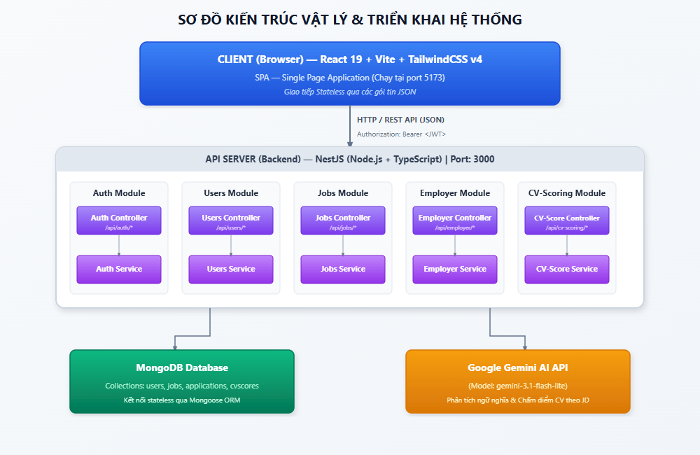
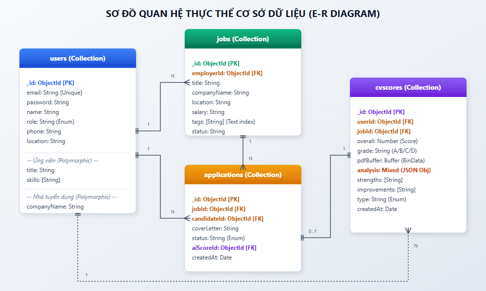
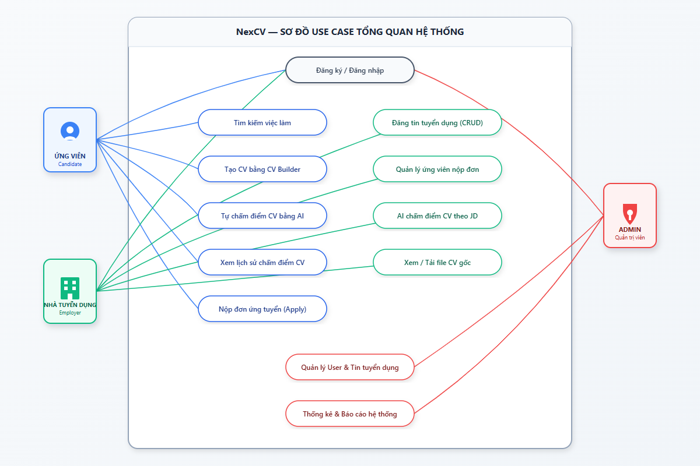
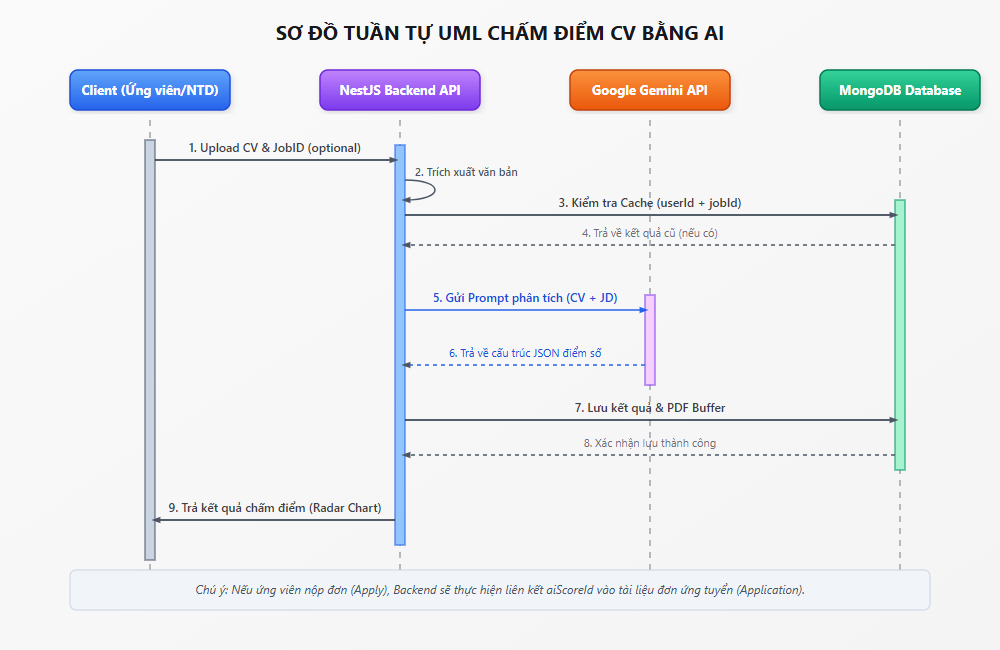

# BÁO CÁO DỰ ÁN: NexCV — NỀN TẢNG QUẢN LÝ CV & TUYỂN DỤNG THÔNG MINH TÍCH HỢP AI

---

## MỤC LỤC

1. [Giới thiệu chung](#1-giới-thiệu-chung)
2. [Mục tiêu dự án](#2-mục-tiêu-dự-án)
3. [Kiến trúc tổng quan hệ thống](#3-kiến-trúc-tổng-quan-hệ-thống)
4. [Mô tả chi tiết Backend](#4-mô-tả-chi-tiết-backend)
5. [Mô tả chi tiết Frontend](#5-mô-tả-chi-tiết-frontend)
6. [Mô tả cơ sở dữ liệu (Database)](#6-mô-tả-cơ-sở-dữ-liệu-database)
7. [Hệ thống AI Chấm điểm CV](#7-hệ-thống-ai-chấm-điểm-cv)
8. [Phân quyền và Bảo mật](#8-phân-quyền-và-bảo-mật)
9. [Luồng hoạt động chính (Use Cases)](#9-luồng-hoạt-động-chính-use-cases)
10. [Công nghệ sử dụng (Tech Stack)](#10-công-nghệ-sử-dụng-tech-stack)
11. [Cấu trúc thư mục chi tiết](#11-cấu-trúc-thư-mục-chi-tiết)
12. [Hướng dẫn cài đặt và khởi chạy](#12-hướng-dẫn-cài-đặt-và-khởi-chạy)
13. [Điểm nổi bật và đặc trưng của dự án](#13-điểm-nổi-bật-và-đặc-trưng-của-dự-án)
14. [Hạn chế và hướng phát triển](#14-hạn-chế-và-hướng-phát-triển)

---

## 1. GIỚI THIỆU CHUNG

**NexCV** là một hệ thống web ứng dụng fullstack, được xây dựng nhằm tích hợp quá trình tạo lập hồ sơ xin việc (CV), tìm kiếm và ứng tuyển công việc, cùng với khả năng phân tích, đánh giá CV tự động bằng trí tuệ nhân tạo (AI) trong một nền tảng duy nhất.

Hệ thống phục vụ ba nhóm người dùng chính:

- **Ứng viên (Candidate / Job Seeker)**: Người tìm việc cần tạo CV chuyên nghiệp, tìm kiếm việc làm phù hợp và nhận phản hồi chất lượng hồ sơ từ AI.
- **Nhà tuyển dụng (Employer)**: Doanh nghiệp cần đăng tin tuyển dụng, quản lý hồ sơ ứng viên và sử dụng AI để lọc, đánh giá CV nhanh chóng.
- **Quản trị viên (Admin)**: Người có quyền kiểm soát, theo dõi và quản lý toàn bộ hoạt động của hệ thống.

---

## 2. MỤC TIÊU DỰ ÁN

- Xây dựng nền tảng tuyển dụng trực tuyến hiện đại, thay thế cho các bảng CV tĩnh truyền thống.
- Tích hợp mô hình AI (Google Gemini) để phân tích CV theo tiêu chuẩn ATS (Applicant Tracking System) — một tiêu chuẩn sàng lọc CV phổ biến tại các doanh nghiệp lớn trên thế giới.
- Cung cấp công cụ thiết kế CV trực quan, cho phép ứng viên tạo CV ngay trên trình duyệt mà không cần phần mềm bên thứ ba.
- Xây dựng hệ thống quản lý tuyển dụng toàn diện, giảm thiểu thao tác thủ công cho nhà tuyển dụng.

### 2.3. Khảo sát các nghiên cứu và ứng dụng liên quan (CLO1.TC2)

Để định hình các tính năng cho dự án NexCV, nhóm nghiên cứu đã thực hiện khảo sát chi tiết về các giải pháp tuyển dụng và công nghệ đánh giá hồ sơ hiện nay trên thị trường:

#### 2.3.1. Các ứng dụng thực tế hiện có

1. **TopCV.vn (Nền tảng tuyển dụng và tạo mẫu CV tại Việt Nam)**
   - *Tóm tắt*: Cung cấp công cụ tạo CV online theo mẫu có sẵn và kết nối ứng viên với nhà tuyển dụng thông qua việc đăng tuyển tin tìm việc. Gần đây, nền tảng có tích hợp bộ lọc từ khóa gợi ý công việc dựa trên các thẻ kỹ năng cơ bản.
   - *Ưu điểm*: Số lượng người dùng lớn, nhiều mẫu CV đa dạng, trực quan, dễ thao tác đối với người dùng phổ thông.
   - *Nhược điểm*: Chưa tích hợp AI phân tích sâu nội dung ngữ nghĩa của CV theo từng mô tả công việc (JD) cụ thể của nhà tuyển dụng. Điểm số đánh giá CV chủ yếu dựa trên mức độ hoàn thiện thông tin (hồ sơ đạt 100% thông tin) chứ không phải chất lượng hay sự tương thích chuyên môn đối với công việc.

2. **Jobscan.co (Hệ thống tối ưu CV theo chuẩn ATS nước ngoài)**
   - *Tóm tắt*: Ứng dụng chuyên biệt cho phép người dùng tải file CV cá nhân và sao chép nội dung mô tả công việc (JD) vào hệ thống để tính điểm phần trăm tương thích (Match Rate) theo các quy tắc chuẩn ATS.
   - *Ưu điểm*: Phân tích cực kỳ chi tiết các từ khóa chuyên môn (Hard Skills), kỹ năng mềm (Soft Skills), định dạng file, lỗi font và cấu trúc đề mục tiêu chuẩn.
   - *Nhược điểm*: Chi phí sử dụng rất cao (yêu cầu trả phí định kỳ để xem phân tích chi tiết), hỗ trợ tiếng Việt rất hạn chế và không có tính năng kết nối trực tiếp với nhà tuyển dụng để nộp đơn.

#### 2.3.2. Bảng so sánh và phân loại giải pháp

*Bảng 2.1: So sánh phân loại NexCV với các giải pháp hiện tại*

| Tiêu chí so sánh | Nền tảng truyền thống (TopCV, VietnamWorks) | Công cụ ATS chuyên sâu (Jobscan) | Giải pháp đề xuất (NexCV) |
|---|---|---|---|
| **Công nghệ cốt lõi** | Cơ sở dữ liệu quan hệ, lọc từ khóa tĩnh | Thuật toán so khớp chuỗi (String Matching) | Tích hợp Trí tuệ nhân tạo (LLM - Gemini) + Fallback Knowledge Base |
| **Khả năng chấm điểm** | Đánh giá độ đầy đủ thông tin hồ sơ | Chấm điểm phần trăm tương thích từ khóa | Đánh giá toàn diện: Kỹ năng, Kinh nghiệm, Học vấn, Format bằng AI |
| **Công cụ tạo CV** | Có mẫu sẵn, chỉnh sửa dạng Form tĩnh | Không hỗ trợ tạo CV | Tích hợp CV Builder kéo thả (Drag & Drop) và xuất PDF trực tiếp |
| **Độ hiểu ngữ nghĩa** | Kém (chỉ lọc từ khóa chính xác) | Trung bình (cần từ khóa khớp hoàn toàn) | Rất cao (AI phân tích ngữ cảnh, từ đồng nghĩa và năng lực) |

#### 2.3.3. Định hướng cải tiến của NexCV
Từ kết quả khảo sát, dự án **NexCV** được thiết kế nhằm kết hợp ưu điểm của cả hai nhóm giải pháp: vừa có tính năng tạo lập CV trực quan như TopCV, vừa tích hợp lõi AI chấm điểm chuyên sâu như Jobscan, đồng thời bổ sung cơ chế **Fallback cục bộ** nhằm đảm bảo tính ổn định và tính sẵn sàng cao của hệ thống.

---

## 3. KIẾN TRÚC TỔNG QUAN HỆ THỐNG

Dự án NexCV được thiết kế theo mô hình kiến trúc Client-Server hiện đại, tách biệt rõ ràng giữa Presentation Layer (Frontend) và Application Layer (Backend), giao tiếp phi trạng thái (stateless) qua RESTful API sử dụng định dạng dữ liệu JSON.

### 3.1. Sơ đồ kiến trúc vật lý (Physical & Deployment Architecture)


*Hình 3.1: Sơ đồ kiến trúc tổng quan hệ thống NexCV*


### 3.2. Kiến trúc phân lớp logic (Logical Architecture)

Hệ thống được chia thành 3 lớp chính:

1. **Presentation Layer (Frontend)**:
   - Xây dựng dưới dạng Single Page Application (SPA) sử dụng **React 19** và **Vite**.
   - **State Management**: Quản lý trạng thái cục bộ của các biểu mẫu phức tạp bằng **Zustand**, và trạng thái xác thực toàn cục bằng **React Context (AuthContext)**.
   - **Styling**: Sử dụng **TailwindCSS v4** kết hợp với **shadcn/ui** và các hiệu ứng mượt mà từ **Framer Motion**.
   - **Drag and Drop Engine**: Sử dụng thư viện **@dnd-kit** để cung cấp giao diện kéo thả trực quan các thành phần CV trong mô-đun CV Builder.

2. **Application Layer (Backend API)**:
   - Triển khai bằng **NestJS** trên nền tảng **Node.js** sử dụng ngôn ngữ **TypeScript**.
   - Tuân thủ nghiêm ngặt mô hình kiến trúc Module của NestJS. Mỗi module tự đóng gói Controller (giao tiếp endpoint), Service (xử lý logic nghiệp vụ), Schema (định nghĩa dữ liệu) và DTO (Data Transfer Object để xác thực dữ liệu đầu vào).
   - **Security Guards**: Sử dụng Passport.js để thiết lập `JwtAuthGuard` (xác thực token) và `RolesGuard` (phân quyền vai trò người dùng).
   - **Pipes & Interceptors**: Sử dụng `ValidationPipe` toàn cục để lọc và kiểm tra tính hợp lệ của dữ liệu gửi lên.

3. **Data Layer**:
   - Sử dụng **MongoDB** làm cơ sở dữ liệu chính.
   - Sử dụng **Mongoose ORM** tại Backend để ánh xạ, định nghĩa và kiểm soát cấu trúc dữ liệu từ NestJS xuống MongoDB.

### 3.3. Các luồng xử lý dữ liệu chính (Data Flows)

#### 3.3.1. Luồng Xác thực và Ủy quyền (Authentication & Authorization Flow)
1. Khách truy cập gửi yêu cầu Đăng nhập (`POST /api/auth/login`) kèm Email và Mật khẩu.
2. `AuthService` kiểm tra tài khoản, mã hóa và so sánh mật khẩu bằng `bcrypt`.
3. Nếu khớp, Backend ký một mã **JWT (JSON Web Token)** chứa payload gồm `userId`, `email` và `role` rồi trả về cho Client.
4. Client lưu trữ token này vào `localStorage` và đưa vào Header `Authorization: Bearer <token>` trong mọi yêu cầu API tiếp theo.
5. Khi nhận yêu cầu đến các route được bảo vệ, `JwtAuthGuard` giải mã token, xác thực chữ ký, và gắn thông tin user vào đối tượng Request (`req.user`). Sau đó, `RolesGuard` đối chiếu quyền truy cập để quyết định cho phép hoặc từ chối yêu cầu.

#### 3.3.2. Luồng Chấm điểm CV bằng AI (AI CV Scoring Flow)
1. Ứng viên tải file CV (PDF/DOCX) lên hệ thống.
2. `CVScoringController` tiếp nhận file thông qua `Multer` dạng Binary Buffer trong bộ nhớ RAM (không ghi file xuống ổ đĩa vật lý của máy chủ để bảo mật).
3. Hệ thống sử dụng thư viện `pdf-parse` (cho PDF) hoặc `mammoth` (cho DOCX) để trích xuất toàn bộ chuỗi văn bản thô (raw text) từ file.
4. `CVScoringService` chuẩn bị một prompt chuyên biệt bao gồm: Nội dung CV thô, Yêu cầu công việc (JD), các từ khóa kỹ năng đích và các ràng buộc đầu ra dưới dạng cấu trúc JSON.
5. Yêu cầu được gửi qua HTTPS POST trực tiếp tới endpoint của **Google Gemini API** (`gemini-3.1-flash-lite`).
6. Gemini phân tích ngữ nghĩa, trả về phản hồi định dạng JSON thô.
7. Service phân tích cú pháp JSON nhận được, tính toán điểm số tổng hợp và lưu kết quả vào Collection `cvscores` trong MongoDB (bao gồm cả file nhị phân gốc `pdfBuffer` để phục vụ xem trực tiếp).
8. Trả kết quả chi tiết về cho Client hiển thị dưới dạng biểu đồ Radar tương tác.

---

## 4. MÔ TẢ CHI TIẾT BACKEND

### 4.1. Tổng quan

Backend được xây dựng trên nền **NestJS** — một framework Node.js với TypeScript theo mô hình module hóa rõ ràng (Module, Controller, Service, Schema). Server lắng nghe tại port `3000`, toàn bộ API được đặt dưới prefix `/api`.

**Cấu hình khởi động (main.ts):**
- **Global Prefix**: `/api` — Tất cả endpoint đều bắt đầu bằng `/api/...`
- **CORS**: Được bật toàn diện, cho phép frontend khác origin kết nối.
- **ValidationPipe**: Tự động validate và transform dữ liệu đầu vào với `whitelist: true`.

### 4.2. Danh sách các Module Backend

#### Module 1: Auth Module (`/api/auth`)

**Chức năng**: Xử lý toàn bộ luồng xác thực người dùng (đăng ký, đăng nhập).

**Các endpoint chính:**

| Phương thức | Endpoint | Mô tả |
|---|---|---|
| POST | `/api/auth/register` | Đăng ký tài khoản mới |
| POST | `/api/auth/login` | Đăng nhập, nhận JWT token |

**Quy trình đăng ký:**
1. Kiểm tra email đã tồn tại trong database chưa. Nếu có → ném lỗi `ConflictException`.
2. Mã hóa mật khẩu bằng `bcrypt` với salt rounds = 10.
3. Lưu người dùng mới vào database.
4. Tạo JWT token từ payload `{ email, sub: _id, role }`.
5. Trả về token và thông tin người dùng đã loại bỏ trường `password`.

**Quy trình đăng nhập:**
1. Tìm user theo email trong database.
2. So sánh mật khẩu đầu vào với hash trong database bằng `bcrypt.compare`.
3. Nếu hợp lệ → Tạo JWT token và trả về.
4. Nếu sai → ném lỗi `UnauthorizedException`.

**JWT Strategy**: Token được ký bằng `JWT_SECRET` từ biến môi trường, payload chứa `email`, `sub` (userId) và `role`.

---

#### Module 2: Users Module (`/api/users`)

**Chức năng**: Quản lý thông tin cá nhân người dùng.

**Các chức năng chính:**
- Tìm kiếm user theo email hoặc ID.
- Tạo user mới (được gọi nội bộ từ AuthService).
- Schema User hỗ trợ hai nhóm field riêng biệt:
  - **Ứng viên**: `title`, `bio`, `skills[]`
  - **Nhà tuyển dụng**: `companyName`, `companyWebsite`, `industry`
  - **Chung**: `avatar`, `phone`, `location`

---

#### Module 3: Jobs Module (`/api/jobs`)

**Chức năng**: Quản lý toàn bộ tin tuyển dụng và đơn ứng tuyển.

**Các endpoint chính:**

| Phương thức | Endpoint | Mô tả | Xác thực |
|---|---|---|---|
| GET | `/api/jobs` | Lấy danh sách việc làm (có lọc, phân trang) | Không cần |
| GET | `/api/jobs/categories` | Lấy danh mục việc làm và số lượng | Không cần |
| GET | `/api/jobs/:id` | Xem chi tiết công việc (tăng lượt view) | Không cần |
| POST | `/api/jobs` | Tạo tin tuyển dụng mới | Employer/Admin |
| PUT | `/api/jobs/:id` | Cập nhật tin tuyển dụng | Employer (chủ sở hữu)/Admin |
| DELETE | `/api/jobs/:id` | Xóa tin tuyển dụng | Employer (chủ sở hữu)/Admin |
| POST | `/api/jobs/:id/apply` | Nộp đơn ứng tuyển | Candidate |
| GET | `/api/jobs/my-applications` | Xem danh sách đơn đã nộp | Candidate |
| POST | `/api/jobs/seed` | Seed dữ liệu mẫu | Admin |

**Tính năng tìm kiếm nâng cao:**
- Hỗ trợ tìm kiếm theo `keyword`, `location`, `category`, `level`, `type`.
- Sử dụng thuật toán chuẩn hóa Unicode (NFD normalization) để so sánh cả dạng có dấu và không dấu tiếng Việt.
- Phân trang với `page` và `limit` (mặc định 20 kết quả/trang).
- Sắp xếp: Tin `featured` lên đầu, sau đó sắp xếp theo thời gian mới nhất.

**Tự động liên kết điểm AI khi nộp đơn:**
Khi ứng viên nộp đơn, hệ thống tự động tìm điểm AI đã được tính trước đó (theo `userId` + `jobId`) và gắn kết vào đơn ứng tuyển thông qua `aiScoreId`.

---

#### Module 4: Employer Module (`/api/employer`)

**Chức năng**: Xử lý các thao tác dành riêng cho nhà tuyển dụng, bao gồm quản lý hồ sơ công ty và danh sách ứng viên.

---

#### Module 5: CV Scoring Module (`/api/cv-scoring`)

**Chức năng**: Module cốt lõi xử lý phân tích, chấm điểm CV bằng AI. (Xem chi tiết tại Mục 7)

**Các endpoint chính:**

| Phương thức | Endpoint | Mô tả | Xác thực |
|---|---|---|---|
| POST | `/api/cv-scoring/score/:jobId` | Nhà tuyển dụng chấm điểm CV ứng viên theo JD | JWT |
| POST | `/api/cv-scoring/candidate-score` | Ứng viên tự chấm điểm CV của mình | JWT |
| GET | `/api/cv-scoring/history` | Xem lịch sử chấm điểm | JWT |
| GET | `/api/cv-scoring/view/:id` | Xem/Tải file CV (kiểm tra quyền truy cập) | JWT |

---

### 4.3. Xử lý file và bảo mật truy cập CV

- File CV được upload bằng `Multer` (lưu trực tiếp vào bộ nhớ RAM, không ghi ra disk).
- File PDF được parse bằng `pdf-parse`; file Word (.docx/.doc) bằng `mammoth`.
- **Nội dung file (Buffer) được lưu thẳng vào MongoDB** trong field `pdfBuffer` của document `CvScore`.
- Khi nhà tuyển dụng muốn xem CV ứng viên, hệ thống kiểm tra quyền truy cập theo quy tắc:
  1. Admin → luôn có quyền xem.
  2. Chủ sở hữu CV → có quyền xem.
  3. Nhà tuyển dụng → chỉ được xem nếu ứng viên đã nộp đơn vào job của họ.

---

## 5. MÔ TẢ CHI TIẾT FRONTEND

### 5.1. Tổng quan

Frontend được xây dựng bằng **React 19** với **Vite** làm build tool, triển khai theo mô hình **SPA (Single Page Application)**. Điều hướng được quản lý bởi `React Router v7` với các **Protected Route** kiểm tra quyền truy cập theo role.

**Font chữ chính**: `Be Vietnam Pro` (Google Fonts) — mang lại vẻ chuyên nghiệp, phù hợp với thị trường Việt Nam.

### 5.2. Hệ thống Layout

Ứng dụng sử dụng 3 layout riêng biệt cho 3 nhóm người dùng:

| Layout | Áp dụng cho | Đặc điểm |
|---|---|---|
| `SeekerLayout` | Ứng viên | Header chính + Footer |
| `EmployerLayout` | Nhà tuyển dụng | Header/Nav riêng cho employer |
| `AdminLayout` | Quản trị viên | Sidebar dọc + Nested Routes |

### 5.3. Hệ thống Route và Phân quyền

**ProtectedRoute**: Kiểm tra xác thực và role trước khi cho phép truy cập trang:
- Chưa đăng nhập → Redirect đến trang login tương ứng.
- Admin cố truy cập trang candidate/employer → Redirect về `/admin`.
- Employer cố truy cập trang candidate → Redirect về `/employer/dashboard`.
- Candidate cố truy cập trang employer → Redirect về `/`.

**GuestRoute**: Chỉ cho phép người dùng chưa đăng nhập truy cập (trang Login, Register):
- Admin đã đăng nhập → Redirect `/admin`.
- Employer đã đăng nhập → Redirect `/employer/dashboard`.
- Candidate đã đăng nhập → Redirect `/`.

### 5.4. Các trang và chức năng chi tiết

#### A. Nhóm trang Ứng viên (Job Seeker)

| Đường dẫn | Component | Mô tả |
|---|---|---|
| `/` | `HomePage` | Trang chủ giới thiệu dịch vụ, tìm kiếm nhanh |
| `/login` | `LoginPage` | Đăng nhập tài khoản ứng viên |
| `/register` | `RegisterPage` | Đăng ký tài khoản ứng viên |
| `/jobs` | `JobsPage` | Danh sách việc làm, bộ lọc tìm kiếm |
| `/jobs/:id` | `JobDetailPage` | Chi tiết công việc, nút ứng tuyển |
| `/cv-upload` | `CVUploadPage` | Upload CV để AI chấm điểm |
| `/cv-builder` | `CVBuilderPage` | Công cụ tạo CV kéo thả *(yêu cầu đăng nhập)* |
| `/profile` | `ProfilePage` | Hồ sơ cá nhân *(yêu cầu đăng nhập)* |
| `/cv-history` | `CVHistoryPage` | Lịch sử chấm điểm CV *(yêu cầu đăng nhập)* |

**Trang Hồ sơ cá nhân (ProfilePage)** — Thiết kế dạng tab:
- **Tab Profile**: Chỉnh sửa thông tin cá nhân, avatar, kỹ năng.
- **Tab Applied**: Danh sách tin tuyển dụng đã nộp đơn và trạng thái.
- **Tab Saved**: Danh sách tin tuyển dụng đã lưu yêu thích.
- **Tab CV**: Quản lý các file CV đã tải lên hệ thống.

#### B. Nhóm trang Nhà tuyển dụng (Employer)

| Đường dẫn | Component | Mô tả |
|---|---|---|
| `/employer` | `EmployerHomePage` | Trang giới thiệu cổng nhà tuyển dụng |
| `/employer/login` | `EmployerLoginPage` | Đăng nhập tài khoản nhà tuyển dụng |
| `/employer/register` | `EmployerRegisterPage` | Đăng ký tài khoản nhà tuyển dụng |
| `/employer/dashboard` | `EmployerDashboard` | Bảng điều khiển, thống kê *(protected)* |
| `/employer/profile` | `EmployerProfilePage` | Quản lý hồ sơ công ty *(protected)* |
| `/employer/jobs` | `EmployerJobsPage` | Danh sách tin tuyển dụng đã đăng *(protected)* |
| `/employer/jobs/new` | `EmployerJobFormPage` | Tạo tin tuyển dụng mới *(protected)* |
| `/employer/jobs/:id/edit` | `EmployerJobFormPage` | Chỉnh sửa tin tuyển dụng *(protected)* |
| `/employer/jobs/:id/applicants` | `EmployerApplicantsPage` | Quản lý ứng viên đã nộp đơn, xem điểm AI *(protected)* |

**Trang quản lý ứng viên (EmployerApplicantsPage)** là trang quan trọng nhất của nhà tuyển dụng:
- Hiển thị danh sách toàn bộ ứng viên đã nộp đơn.
- Kích hoạt chấm điểm AI CV của ứng viên theo JD.
- Xem điểm số chi tiết và nhận xét từ AI.
- Xem/tải file CV của ứng viên (có kiểm tra quyền truy cập).

#### C. Nhóm trang Quản trị viên (Admin)

| Đường dẫn | Component | Mô tả |
|---|---|---|
| `/admin/login` | `AdminLoginPage` | Đăng nhập tài khoản admin |
| `/admin` | `AdminDashboard` | Dashboard thống kê tổng quan |
| `/admin/users` | `AdminUsersPage` | Quản lý danh sách người dùng |
| `/admin/jobs` | `AdminJobsPage` | Quản lý toàn bộ tin tuyển dụng |
| `/admin/jobs/:id` | `AdminJobDetailsPage` | Chi tiết và quản lý một tin cụ thể |
| `/admin/cv-scores` | `AdminCVScoresPage` | Xem lịch sử điểm CV của tất cả người dùng |
| `/admin/notifications` | `AdminNotificationsPage` | Gửi và quản lý thông báo hệ thống |
| `/admin/reports` | `AdminReportsPage` | Báo cáo thống kê chi tiết |
| `/admin/settings` | `AdminSettingsPage` | Cấu hình hệ thống |

### 5.5. CV Builder (Công cụ tạo CV kéo thả)

CV Builder là tính năng kỹ thuật phức tạp nhất trên Frontend, bao gồm các thành phần độc lập:

| Thành phần (Section) | File | Mô tả |
|---|---|---|
| Thông tin cá nhân | `PersonalSection.jsx` | Họ tên, email, số điện thoại, địa chỉ |
| Ảnh đại diện | `PhotoSection.jsx` | Upload và hiển thị ảnh trong CV |
| Học vấn | `EducationSection.jsx` | Trường học, chuyên ngành, năm tốt nghiệp |
| Kinh nghiệm | `ExperienceSection.jsx` | Lịch sử công việc với các mốc thời gian |
| Kỹ năng | `SkillsSection.jsx` | Danh sách kỹ năng với mức độ thành thạo |
| Ngoại ngữ | `LanguagesSection.jsx` | Ngôn ngữ và trình độ tương ứng |

**Tính năng nổi bật của CV Builder:**
- Giao diện WYSIWYG — Thấy ngay kết quả khi chỉnh sửa.
- Hỗ trợ kéo thả (drag & drop) để sắp xếp thứ tự các mục trong CV.
- Tích hợp in ấn trực tiếp qua `react-to-print`, đảm bảo định dạng đúng khi in ra giấy hoặc xuất PDF.

### 5.6. Quản lý trạng thái (State Management)

- **AuthContext**: Context toàn cục quản lý trạng thái đăng nhập (`isAuthenticated`, `isEmployer`, `isAdmin`, `user`, `token`, `logout`).
- **Zustand**: Dùng cho các state phức tạp không cần truyền qua toàn cây component (ví dụ: dữ liệu CV Builder).
- **Local API Services**: Mỗi nhóm chức năng có file service riêng trong `/src/services/` để gọi API backend.

---

## 6. MÔ TẢ CƠ SỞ DỮ LIỆU (DATABASE)

### 6.1. Đặc trưng thiết kế Cơ sở dữ liệu với MongoDB (NoSQL) (CLO2.TC1)

Hệ thống NexCV sử dụng **MongoDB** làm hệ quản trị cơ sở dữ liệu chính. So với các hệ quản trị cơ sở dữ liệu quan hệ truyền thống (RDBMS) như MySQL hay PostgreSQL, MongoDB sở hữu những đặc tính NoSQL hướng tài liệu (Document-oriented) mang lại các lợi thế lớn cho dự án:

1. **Thiết kế phi lược đồ (Schemaless/Dynamic Schema)**:
   MongoDB không bắt buộc định nghĩa cứng nhắc các cột và kiểu dữ liệu ở mức vật lý của cơ sở dữ liệu. Mỗi bản ghi (document) trong một bảng (collection) có thể chứa các trường dữ liệu khác nhau. Điều này cực kỳ hữu ích đối với việc lưu trữ hồ sơ người dùng (User) có nhiều vai trò (Ứng viên có kỹ năng, học vấn; Nhà tuyển dụng có thông tin công ty, website) và kết quả phân tích CV của AI vốn có cấu trúc dữ liệu động, lồng nhau phức tạp.

2. **Kiểm soát và áp đặt Schema ở mức ứng dụng (Application-level Schema Enforcement)**:
   Để đảm bảo tính toàn vẹn của dữ liệu trong khi vẫn giữ lại tính linh hoạt của MongoDB, hệ thống sử dụng **Mongoose ORM** tại tầng Backend. Mongoose đóng vai trò định nghĩa các Schema lớp ứng dụng, thiết lập kiểu dữ liệu, các ràng buộc dữ liệu đầu vào (Required, Unique, Enum) và gán các giá trị mặc định (Default values) trước khi dữ liệu được ghi xuống cơ sở dữ liệu MongoDB.

3. **Thiết kế thực thể đa hình (Polymorphic Documents)**:
   Nhờ tính phi lược đồ của MongoDB, hệ thống lưu chung toàn bộ các vai trò người dùng (Candidate, Employer, Admin) trong cùng một collection `users`. 
   - Đối với **Ứng viên**: chỉ các trường `title`, `bio`, `skills` mới được lưu.
   - Đối với **Nhà tuyển dụng**: chỉ các trường `companyName`, `companyWebsite`, `industry` được lưu.
   Các tài liệu này được phân biệt thông qua trường phân loại `role`. Phương pháp này giúp tránh được việc lãng phí bộ nhớ lưu trữ cho các trường trống (NULL values) như trong SQL, đồng thời tối ưu hóa tốc độ truy vấn thông tin người dùng chỉ trên một collection duy nhất.

4. **Lưu trữ dữ liệu lớn dạng Nhị phân (Binary Large Objects - BSON BinData)**:
   MongoDB lưu trữ dữ liệu dưới định dạng BSON (Binary JSON). Hệ thống tận dụng trường dữ liệu `pdfBuffer` kiểu `Buffer` (BSON Subtype 0) trong collection `cvscores` để lưu trữ trực tiếp nội dung nhị phân của file CV. Việc lưu file trực tiếp trong MongoDB giúp đồng bộ hóa dữ liệu (backup đơn giản chỉ bằng cách dump database), dễ dàng phân quyền truy cập thông tin CV trực tiếp bằng mã nguồn Backend mà không cần cấu hình chia sẻ tài nguyên phức tạp trên các dịch vụ cloud storage như AWS S3.

5. **Lưu trữ cấu trúc lồng nhau linh hoạt (Nested/Embedded Documents)**:
   Kết quả phân tích chi tiết của AI (phản hồi chi tiết từ Gemini) được lưu trực tiếp dưới dạng một JSON Object lồng trong trường `analysis` của collection `cvscores` (sử dụng kiểu dữ liệu `Schema.Types.Mixed` của Mongoose). Việc lưu trữ tài liệu lồng nhau này giúp hệ thống truy xuất toàn bộ thông tin kết quả đánh giá CV chỉ bằng **một truy vấn duy nhất**, tránh được các thao tác kết hợp bảng (JOIN) tốn kém tài nguyên trong RDBMS.

6. **Chiến lược liên kết dữ liệu lai (Hybrid Relationships)**:
   Mặc dù là cơ sở dữ liệu NoSQL, hệ thống vẫn duy trì các liên kết logic chặt chẽ thông qua cơ chế tham chiếu (Referencing) bằng `ObjectId` của Mongoose (sử dụng phương thức `populate` để tự động điền dữ liệu liên kết):
   - Mối quan hệ 1-Nhiều (1-N) giữa Nhà tuyển dụng và Việc làm: `jobs.employerId` liên kết đến `users._id`.
   - Mối quan hệ N-Nhiều (N-N) thông qua bảng trung gian: `applications` liên kết chéo giữa `jobs._id` và `users._id` (candidateId).

### 6.2. Sơ đồ kiến trúc thực thể cơ sở dữ liệu (UML E-R Database Diagram)

Để có cái nhìn tổng quan về cách dữ liệu được tổ chức và liên kết trong MongoDB của NexCV, sơ đồ dưới đây biểu diễn các Collection chính dưới dạng UML Class Diagram / Entity-Relationship (E-R) Diagram:


*Hình 6.1: Sơ đồ mối quan hệ UML thực thể trong Database NexCV*

#### Sơ đồ liên kết vật lý (Collection Physical Relationships)

Sơ đồ dưới đây đặc tả chi tiết hơn về các liên kết vật lý bao gồm cả các mảng kỹ năng và tài liệu phân tích động lồng nhau (Embedded documents) được lưu trữ trực tiếp trong cơ sở dữ liệu:


*Hình 6.2: Sơ đồ cấu trúc vật lý các Collection trong database NexCV*


### 6.3. Chi tiết cấu trúc Schema của các Collection

#### Collection: `users` (Bảng Người dùng)
*Bảng 6.1: Cấu trúc Collection users*

| Trường dữ liệu (Field) | Kiểu dữ liệu Mongoose | Ràng buộc dữ liệu | Mô tả chi tiết |
|---|---|---|---|
| `_id` | ObjectId | Tự động sinh, Khóa chính | Định danh duy nhất của người dùng |
| `email` | String | Bắt buộc, Không trùng lặp | Email dùng làm tài khoản đăng nhập |
| `password` | String | Bắt buộc | Mật khẩu người dùng đã băm bằng bcrypt |
| `name` | String | Bắt buộc | Họ và tên hiển thị |
| `role` | String | Bắt buộc, Enum: ['candidate', 'employer', 'admin'] | Vai trò người dùng trên hệ thống |
| `avatar` | String | Không bắt buộc | URL trỏ tới ảnh đại diện |
| `phone` | String | Không bắt buộc | Số điện thoại liên hệ |
| `location` | String | Không bắt buộc | Địa chỉ cư trú hoặc trụ sở |
| `title` | String | Không bắt buộc (Chỉ Candidate) | Vị trí công việc mong muốn/hiện tại |
| `bio` | String | Không bắt buộc (Chỉ Candidate) | Tiêu sử/Mô tả bản thân ngắn gọn |
| `skills` | [String] | Không bắt buộc (Chỉ Candidate) | Mảng chứa danh sách các từ khóa kỹ năng |
| `companyName` | String | Không bắt buộc (Chỉ Employer) | Tên công ty/Doanh nghiệp tuyển dụng |
| `companyWebsite` | String | Không bắt buộc (Chỉ Employer) | Website chính thức của công ty |
| `industry` | String | Không bắt buộc (Chỉ Employer) | Lĩnh vực hoạt động của doanh nghiệp |
| `createdAt` | Date | Tự động sinh (timestamp) | Thời điểm đăng ký tài khoản |
| `updatedAt` | Date | Tự động sinh (timestamp) | Thời điểm cập nhật thông tin gần nhất |

#### Collection: `jobs` (Bảng Tin tuyển dụng)
*Bảng 6.2: Cấu trúc Collection jobs*

| Trường dữ liệu (Field) | Kiểu dữ liệu Mongoose | Ràng buộc dữ liệu | Mô tả chi tiết |
|---|---|---|---|
| `_id` | ObjectId | Tự động sinh, Khóa chính | Định danh duy nhất của tin tuyển dụng |
| `employerId` | ObjectId | Bắt buộc, Ref: 'User' | ID tài khoản nhà tuyển dụng đã đăng tin |
| `title` | String | Bắt buộc | Tiêu đề tin tuyển dụng (Vị trí cần tuyển) |
| `companyName` | String | Bắt buộc | Tên công ty hiển thị trong tin tuyển dụng |
| `companyLogo` | String | Không bắt buộc | Đường dẫn đến ảnh logo công ty |
| `location` | String | Bắt buộc | Địa điểm làm việc (ví dụ: Hà Nội, TP.HCM) |
| `salary` | String | Không bắt buộc | Mức lương hiển thị (ví dụ: "Cạnh tranh", "15 - 20 triệu") |
| `salaryMin` | Number | Không bắt buộc | Mức lương tối thiểu (dùng để lọc công việc) |
| `salaryMax` | Number | Không bắt buộc | Mức lương tối đa (dùng để lọc công việc) |
| `category` | String | Bắt buộc | Danh mục ngành nghề (ví dụ: IT, Marketing) |
| `type` | String | Bắt buộc, Enum | Hình thức: Full-time, Part-time, Remote, Internship |
| `level` | String | Bắt buộc | Cấp bậc yêu cầu (ví dụ: Junior, Senior, Intern) |
| `tags` | [String] | Không bắt buộc | Các từ khóa kỹ năng bổ sung để tìm kiếm |
| `description` | String | Bắt buộc | Mô tả công việc chi tiết dạng văn bản |
| `requirements` | [String] | Không bắt buộc | Danh sách các yêu cầu công việc chi tiết |
| `benefits` | [String] | Không bắt buộc | Các quyền lợi được hưởng của ứng viên |
| `deadline` | Date | Không bắt buộc | Hạn cuối cùng nhận hồ sơ ứng tuyển |
| `views` | Number | Mặc định: 0 | Lượt xem chi tiết tin tuyển dụng |
| `applied` | Number | Mặc định: 0 | Số lượt ứng viên đã nộp hồ sơ |
| `featured` | Boolean | Mặc định: false | Cờ đánh dấu công việc nổi bật |
| `status` | String | Mặc định: 'active' | Trạng thái tin: 'active' hoặc 'inactive' |

* **Tối ưu hóa Tìm kiếm (Database Indexes)**:
  Để hỗ trợ tính năng tìm kiếm công việc thông minh, hệ thống cấu hình một **Text Index** (Chỉ mục văn bản) tổng hợp trên các trường: `title`, `companyName`, `description`, và `tags`. Điều này cho phép thực hiện truy vấn văn bản phức tạp thông qua toán tử `$text` của MongoDB, hỗ trợ tìm kiếm mờ (fuzzy search) và tìm kiếm không dấu tốc độ cao.

#### Collection: `applications` (Bảng Đơn ứng tuyển)
*Bảng 6.3: Cấu trúc Collection applications*

| Trường dữ liệu (Field) | Kiểu dữ liệu Mongoose | Ràng buộc dữ liệu | Mô tả chi tiết |
|---|---|---|---|
| `_id` | ObjectId | Tự động sinh, Khóa chính | Định danh duy nhất của đơn ứng tuyển |
| `jobId` | ObjectId | Bắt buộc, Ref: 'Job' | ID công việc được ứng tuyển |
| `candidateId` | ObjectId | Bắt buộc, Ref: 'User' | ID tài khoản ứng viên đã nộp đơn |
| `coverLetter` | String | Không bắt buộc | Thư giới thiệu kèm theo của ứng viên |
| `cvId` | String | Không bắt buộc | ID tham chiếu đến file CV được lưu ở hệ thống |
| `status` | String | Mặc định: 'pending' | Trạng thái đơn: pending, reviewing, interview, offered, rejected |
| `aiScoreId` | ObjectId | Không bắt buộc, Ref: 'CvScore' | Liên kết trực tiếp kết quả chấm điểm của AI cho đơn này |
| `createdAt` | Date | Tự động sinh (timestamp) | Thời điểm nộp đơn ứng tuyển |

#### Collection: `cvscores` (Bảng Kết quả đánh giá CV)
*Bảng 6.4: Cấu trúc Collection cvscores*

| Trường dữ liệu (Field) | Kiểu dữ liệu Mongoose | Ràng buộc dữ liệu | Mô tả chi tiết |
|---|---|---|---|
| `_id` | ObjectId | Tự động sinh, Khóa chính | Định danh duy nhất của kết quả đánh giá |
| `userId` | ObjectId | Không bắt buộc, Ref: 'User' | ID ứng viên sở hữu file CV |
| `jobId` | ObjectId | Không bắt buộc, Ref: 'Job' | ID công việc được so khớp (nếu có) |
| `cvUrl` | String | Không bắt buộc | Tên hoặc đường dẫn lưu file CV |
| `score` | Number | Không bắt buộc | Điểm đánh giá tổng hợp quy về thang 10 |
| `analysis` | Schema.Types.Mixed | Không bắt buộc (Dynamic JSON) | JSON Object lồng nhau chứa chi tiết phân tích từ AI |
| `type` | String | Bắt buộc, Enum | Loại chấm điểm: candidate_self_score, employer_match |
| `pdfBuffer` | Buffer | Bắt buộc | Dữ liệu nhị phân nguyên bản của file CV (PDF/DOCX) |
| `overall` | Number | Không bắt buộc | Điểm số tổng tương thích thang 100 |
| `grade` | String | Không bắt buộc | Xếp loại năng lực dạng chữ: A, B, C, D |
| `gradeLabel` | String | Không bắt buộc | Nhãn mô tả xếp loại (ví dụ: Xuất sắc, Tốt, Khá) |
| `strengths` | [String] | Mặc định: [] | Danh sách các điểm mạnh do AI trích xuất |
| `improvements` | [String] | Mặc định: [] | Danh sách các điểm yếu và gợi ý sửa đổi từ AI |
| `categories` | Schema.Types.Mixed | Không bắt buộc | Mảng điểm số chi tiết cho từng hạng mục kỹ năng |

* **Tối ưu hóa Truy vấn (Compound Index)**:
  Hệ thống cấu hình một **Compound Index (Chỉ mục kép)** trên hai trường `{ userId: 1, jobId: 1 }`. Chỉ mục này giúp tối ưu hóa luồng nghiệp vụ **"Tái sử dụng kết quả chấm điểm (Score Reuse)"**. Khi nhà tuyển dụng yêu cầu xem điểm hoặc ứng viên nộp đơn lại, Backend kiểm tra sự tồn tại của kết quả nhanh chóng trong DB bằng chỉ mục kép mà không cần quét toàn bộ bảng dữ liệu.

---

## 7. HỆ THỐNG AI CHẤM ĐIỂM CV

### 7.1. Tổng quan

CV Scoring là tính năng cốt lõi và phức tạp nhất của NexCV. Hệ thống sử dụng chiến lược **đa lớp** để đảm bảo luôn trả về kết quả ngay cả khi dịch vụ AI gặp sự cố.

### 7.2. Mô hình AI sử dụng

- **Nhà cung cấp**: Google AI (Gemini)
- **Model**: `gemini-3.1-flash-lite-preview`
- **Giao tiếp**: REST API trực tiếp qua HTTP (không dùng SDK), endpoint: `https://generativelanguage.googleapis.com/v1beta/models`
- **Cấu hình sinh văn bản**: Temperature = 0.2 (phản hồi ổn định, nhất quán), Response MIME type = `application/json`

### 7.3. Hai chế độ chấm điểm

#### Chế độ 1: Ứng viên tự chấm điểm CV (Candidate Self Score)

**Endpoint**: `POST /api/cv-scoring/candidate-score`

**Luồng xử lý:**

```
[Ứng viên upload file CV (PDF/DOCX)]
         ↓
[Trích xuất văn bản: pdf-parse hoặc mammoth]
         ↓
[Kiểm tra điểm cũ trong DB (userId + jobId)] → [Nếu có: trả về điểm cũ]
         ↓ (Nếu chưa có)
[Gửi prompt đến Gemini AI với thông tin:]
  - Vị trí ứng tuyển (targetPosition)
  - Mô tả công việc (JD) — nếu có
  - Yêu cầu kỹ năng — nếu có
  - Toàn bộ nội dung CV
         ↓
[AI phân tích và trả về JSON:]
  - isValidCv: true/false (phát hiện spam)
  - overall: 1-100
  - grade: A/B/C/D
  - strengths: []
  - improvements: []
  - categories: [skills, experience, education, format, keywords]
         ↓
[Lưu kết quả vào collection cvscores]
         ↓
[Trả về kết quả cho Frontend hiển thị]
```

**Tính năng phát hiện Spam CV:**
Nếu Gemini xác định tài liệu không phải là CV (sách, bài báo, nội dung ngẫu nhiên...), hệ thống trả về lỗi với thông báo rõ ràng và không tính điểm.

#### Chế độ 2: Nhà tuyển dụng chấm điểm CV ứng viên (Employer Match Score)

**Endpoint**: `POST /api/cv-scoring/score/:jobId`

**Luồng xử lý:**

```
[NTD kích hoạt chấm điểm cho ứng viên]
         ↓
[Kiểm tra điểm cũ (candidateId + jobId)] → [Nếu có: tái sử dụng, tạo nhận xét ngữ cảnh mới]
         ↓ (Nếu chưa có)
[Lấy file CV từ DB (pdfBuffer) hoặc nhận file upload mới]
         ↓
[Trích xuất văn bản]
         ↓
[Gửi prompt đến Gemini AI với JD cụ thể của job]
         ↓
[Lưu kết quả, gắn aiScoreId vào Application]
         ↓
[Trả về điểm và nhận xét cho NTD]
```

**Tối ưu hóa: Tái sử dụng kết quả (Score Reuse):**
Nếu ứng viên đã được chấm điểm trước đó cho cùng job, hệ thống không gọi AI lại mà sử dụng điểm cũ, chỉ gọi AI để tạo thêm "nhận xét dành riêng cho nhà tuyển dụng" (employer context) từ dữ liệu phân tích có sẵn. Điều này giúp tiết kiệm token API và giảm chi phí vận hành.

### 7.4. Cơ chế Fallback — Local Knowledge Base

Khi Gemini API không khả dụng (chưa cấu hình key, lỗi mạng...), hệ thống tự động chuyển sang thuật toán so khớp từ khóa nội bộ.

**Knowledge Base** gồm 10 lĩnh vực chuyên môn:

| Lĩnh vực | Ví dụ từ khóa |
|---|---|
| Frontend | react, vue, angular, nextjs, typescript, tailwind, redux... |
| Backend | nodejs, nestjs, java, spring boot, python, django, mongodb, redis... |
| Mobile | flutter, react native, swift, kotlin, firebase... |
| DevOps | docker, kubernetes, jenkins, ci/cd, aws, azure, terraform... |
| Data/AI | python, machine learning, pandas, tensorflow, pytorch, tableau... |
| Tester/QA | selenium, cypress, playwright, jest, api testing, jira... |
| Design | figma, adobe xd, ui/ux, figma, wireframe, prototype... |
| Management | agile, scrum, project management, backlog, jira... |
| Marketing | seo, sem, google ads, content marketing, social media... |
| Soft Skills | teamwork, communication, problem solving, leadership... |

**Thuật toán tính điểm Fallback (5 tiêu chí):**

1. **Kỹ năng (Skills Match) — Trọng số 35%**: Đếm số từ khóa trong Knowledge Base xuất hiện trong CV, tính tỷ lệ phần trăm.
2. **Kinh nghiệm (Experience) — Trọng số 25%**: Phát hiện từ khóa liên quan đến kinh nghiệm, cộng thưởng nếu CV ghi rõ số năm kinh nghiệm.
3. **Dự án (Projects) — Trọng số 15%**: Đếm đề cập đến các dự án, link demo, GitHub...
4. **Học vấn (Education) — Trọng số 10%**: Phát hiện thông tin trường học, bằng cấp, chứng chỉ (IELTS, AWS, PMP...).
5. **Định dạng (Format) — Trọng số 10%**: Kiểm tra độ dài CV, sự hiện diện của email và số điện thoại hợp lệ.

**Từ khóa ATS (5%)**: Tổng hợp từ điểm kỹ năng và định dạng.

---

## 8. PHÂN QUYỀN VÀ BẢO MẬT

### 8.1. Cơ chế xác thực

- **JWT (JSON Web Token)**: Token được ký bằng `JWT_SECRET` trong `.env`. Payload chứa `{ email, sub (userId), role }`.
- **JwtAuthGuard**: Guard NestJS bảo vệ các endpoint yêu cầu đăng nhập. Tự động trích xuất và xác thực token từ header `Authorization: Bearer <token>`.
- **RolesGuard**: Guard kiểm tra role của người dùng (`@Roles('admin')`, `@Roles('employer')`...).

### 8.2. Ma trận phân quyền

| Chức năng | Ứng viên | Nhà tuyển dụng | Quản trị viên |
|---|---|---|---|
| Xem danh sách việc làm | ✅ | ✅ | ✅ |
| Nộp đơn ứng tuyển | ✅ | ❌ | ❌ |
| Tạo/sửa/xóa tin tuyển dụng | ❌ | ✅ (của mình) | ✅ (tất cả) |
| Xem hồ sơ ứng viên | ❌ | ✅ (ứng viên của job mình) | ✅ |
| Tự chấm điểm CV | ✅ | ❌ | ❌ |
| Chấm điểm CV ứng viên | ❌ | ✅ | ✅ |
| Xem file CV ứng viên | ❌ | ✅ (ứng viên đã apply job của mình) | ✅ |
| Quản lý tất cả người dùng | ❌ | ❌ | ✅ |
| Xem báo cáo toàn hệ thống | ❌ | ❌ | ✅ |

### 8.3. Bảo mật mật khẩu

- Mật khẩu được mã hóa một chiều bằng `bcrypt` với `saltRounds = 10` trước khi lưu vào database.
- Không bao giờ trả về trường `password` trong response API (được xóa bởi `sanitizeUser()`).

---

## 9. SƠ ĐỒ USE CASE VÀ CÁC SƠ ĐỒ TUẦN TỰ UML HỆ THỐNG

### 9.1. Sơ đồ Use Case tổng quát hệ thống (System Use Case Diagram)

Sơ đồ dưới đây biểu diễn các tác nhân (Actors) chính bao gồm Ứng viên (Candidate), Nhà tuyển dụng (Employer), và Quản trị viên (Admin) cùng với các tương tác chức năng cốt lõi trên nền tảng NexCV:


*Hình 9.1: Sơ đồ Use Case tổng quát hệ thống NexCV*

### 9.2. Sơ đồ tuần tự UML chấm điểm CV bằng AI (UML Sequence Diagram)

Sơ đồ dưới đây đặc tả luồng xử lý đồng bộ và bất đồng bộ khi ứng viên hoặc nhà tuyển dụng kích hoạt chức năng chấm điểm CV bằng AI, minh họa mối liên kết giữa Client, API Gateway của NestJS Backend, lõi phân tích Google Gemini API và Cơ sở dữ liệu MongoDB:


*Hình 9.2: Sơ đồ tuần tự UML tiến trình phân tích và chấm điểm CV*

### 9.3. Các luồng hoạt động chính (Workflow Descriptions)

#### 9.3.1. Luồng Ứng viên tìm việc và nộp đơn
1. Ứng viên truy cập trang chủ (`/`).
2. Tìm kiếm việc làm bằng từ khóa hoặc lọc theo danh mục, địa điểm làm việc mong muốn.
3. Xem thông tin chi tiết tin tuyển dụng (`/jobs/:id`).
4. Tiến hành Đăng nhập hoặc đăng ký tài khoản Candidate (`/login`, `/register`).
5. Tải file hồ sơ cá nhân lên hệ thống tại trang chấm điểm AI (`/cv-upload`).
6. Xem kết quả đánh giá năng lực của AI thông qua biểu đồ Radar hiển thị 5 tiêu chí kỹ năng.
7. Chọn công việc phù hợp, điền thư giới thiệu (Cover Letter) và nhấn nộp đơn ứng tuyển (Apply).
8. Theo dõi, cập nhật tiến trình phê duyệt hồ sơ trong tab "Applied" tại trang cá nhân (`/profile`).

#### 9.3.2. Luồng Nhà tuyển dụng tuyển dụng
1. Nhà tuyển dụng đăng nhập tài khoản Employer.
2. Tạo tin tuyển dụng mới (`/employer/jobs/new`) với đầy đủ mô tả công việc (JD), các từ khóa kỹ năng đích (tags) và hạn nộp hồ sơ.
3. Truy cập trang quản lý danh sách ứng viên đã nộp đơn (`/employer/jobs/:id/applicants`).
4. Kích hoạt tính năng AI chấm điểm để so khớp mức độ tương thích giữa CV của ứng viên với JD.
5. Xem báo cáo chi tiết về điểm mạnh, điểm yếu và các xếp hạng do AI đánh giá để hỗ trợ quyết định phỏng vấn.
6. Mở trình duyệt xem hoặc tải về file CV gốc của ứng viên.

#### 9.3.3. Luồng Ứng viên tạo CV mới bằng CV Builder
1. Truy cập trang tạo CV (`/cv-builder`) sau khi xác thực.
2. Điền thông tin cá nhân, cập nhật ảnh đại diện và nhập các trường: Học vấn, Kinh nghiệm làm việc, Kỹ năng và Ngoại ngữ.
3. Sử dụng chuột để kéo thả để sắp xếp thứ tự các mục hiển thị trong CV theo mong muốn.
4. Trình duyệt cập nhật bản xem trước (Preview) trực quan theo thời gian thực (realtime).
5. Thực hiện lưu trữ, in trực tiếp hoặc xuất file PDF chuẩn định dạng.

---

## 10. CÔNG NGHỆ SỬ DỤNG (TECH STACK)

### Backend

| Thư viện / Framework | Phiên bản | Vai trò |
|---|---|---|
| NestJS | ^11.0.1 | Framework chính, TypeScript |
| Mongoose | ^9.6.0 | ORM cho MongoDB |
| @nestjs/jwt | ^11.0.2 | Tạo và xác thực JWT |
| @nestjs/passport | ^11.0.5 | Tích hợp Passport.js |
| passport-jwt | ^4.0.1 | JWT Strategy cho Passport |
| bcrypt | ^6.0.0 | Mã hóa mật khẩu |
| multer | ^2.1.1 | Upload file multipart |
| pdf-parse | ^1.1.1 | Đọc nội dung file PDF |
| mammoth | ^1.12.0 | Đọc nội dung file Word (.docx) |
| class-validator | ^0.15.1 | Validate DTO đầu vào |
| class-transformer | ^0.5.1 | Transform đối tượng TypeScript |

### Frontend

| Thư viện / Framework | Phiên bản | Vai trò |
|---|---|---|
| React | ^19.2.0 | UI Framework |
| Vite | ^5.4.10 | Build tool và Dev server |
| React Router DOM | ^7.13.1 | Điều hướng SPA |
| TailwindCSS | ^4.2.1 | Utility-first CSS framework |
| shadcn/ui + Radix UI | latest | Component library headless |
| Framer Motion | ^12.38.0 | Animation và transitions |
| Recharts | ^3.8.1 | Biểu đồ điểm số |
| @dnd-kit | ^6.3.1 | Drag and drop cho CV Builder |
| Zustand | ^5.0.12 | State management nhẹ |
| react-to-print | ^3.3.0 | In CV trực tiếp từ trình duyệt |
| date-fns | ^4.1.0 | Xử lý ngày tháng |
| lucide-react | ^0.577.0 | Bộ icon SVG |

### Database & Hạ tầng

| Công cụ | Mô tả |
|---|---|
| MongoDB | Cơ sở dữ liệu NoSQL chính |
| Google Gemini AI API | Mô hình ngôn ngữ lớn (LLM) phân tích CV |
| Vercel | Triển khai Frontend (cấu hình `vercel.json`) |

---

## 11. CẤU TRÚC THƯ MỤC CHI TIẾT

```
CV/                                         ← Thư mục gốc dự án
│
├── README.md                               ← Tài liệu giới thiệu dự án
│
├── backend/                                ← NestJS API Server
│   ├── src/
│   │   ├── main.ts                         ← Điểm khởi động server (port, CORS, prefix)
│   │   ├── app.module.ts                   ← Module gốc, kết nối MongoDB, import modules
│   │   ├── app.controller.ts               ← Controller mặc định NestJS
│   │   ├── app.service.ts                  ← Service mặc định NestJS
│   │   ├── seed.ts                         ← Script khởi tạo dữ liệu mẫu
│   │   │
│   │   ├── auth/                           ← Module Xác thực
│   │   │   ├── auth.module.ts
│   │   │   ├── auth.controller.ts          ← /api/auth/register, /api/auth/login
│   │   │   ├── auth.service.ts             ← Logic đăng ký, đăng nhập, tạo JWT
│   │   │   ├── dto/auth.dto.ts             ← Validate dữ liệu đầu vào
│   │   │   ├── decorators/
│   │   │   │   └── roles.decorator.ts      ← @Roles() decorator
│   │   │   ├── guards/
│   │   │   │   ├── jwt-auth.guard.ts       ← Guard yêu cầu JWT
│   │   │   │   └── roles.guard.ts          ← Guard kiểm tra role
│   │   │   └── strategies/
│   │   │       └── jwt.strategy.ts         ← Xác thực JWT, inject user vào request
│   │   │
│   │   ├── users/                          ← Module Người dùng
│   │   │   ├── users.module.ts
│   │   │   ├── users.service.ts            ← findByEmail, findById, create
│   │   │   └── schemas/user.schema.ts      ← Schema MongoDB cho User
│   │   │
│   │   ├── jobs/                           ← Module Việc làm
│   │   │   ├── jobs.module.ts
│   │   │   ├── jobs.controller.ts          ← CRUD jobs, apply, my-applications
│   │   │   ├── jobs.service.ts             ← Logic tìm kiếm, CRUD, ứng tuyển
│   │   │   ├── jobs-seed.data.ts           ← Dữ liệu mẫu việc làm
│   │   │   └── schemas/
│   │   │       ├── job.schema.ts           ← Schema MongoDB cho Job
│   │   │       └── application.schema.ts   ← Schema MongoDB cho Application
│   │   │
│   │   ├── employer/                       ← Module Nhà tuyển dụng
│   │   │   └── employer.module.ts
│   │   │
│   │   └── cv-scoring/                     ← Module AI Chấm điểm CV
│   │       ├── cv-scoring.module.ts
│   │       ├── cv-scoring.controller.ts    ← score/:jobId, candidate-score, history, view/:id
│   │       ├── cv-scoring.service.ts       ← Logic phân tích, gọi Gemini, fallback
│   │       ├── cv-scoring.controller.spec.ts
│   │       ├── cv-scoring.service.spec.ts
│   │       ├── constants/
│   │       │   └── knowledge-base.ts       ← ROLE_KNOWLEDGE_BASE, ROLE_MAPPING
│   │       └── schemas/
│   │           └── cv-score.schema.ts      ← Schema MongoDB cho CvScore
│   │
│   ├── scratch/                            ← File thử nghiệm (không phải production code)
│   │   ├── list-models.js
│   │   ├── test-gemini.js
│   │   └── test-gemini-v1.js
│   ├── package.json
│   ├── tsconfig.json
│   └── .env                               ← MONGO_URI, JWT_SECRET, GEMINI_API_KEY
│
└── frontend/                              ← React + Vite Client
    ├── index.html                         ← HTML entry point
    ├── vite.config.js                     ← Cấu hình Vite
    ├── tailwind.config.js                 ← Cấu hình TailwindCSS
    ├── vercel.json                        ← Cấu hình deploy Vercel (SPA redirect)
    ├── package.json
    ├── .env                               ← VITE_API_URL
    └── src/
        ├── main.jsx                       ← Điểm vào React, mount App
        ├── App.jsx                        ← Định nghĩa toàn bộ Routes và Layouts
        ├── App.css / index.css            ← CSS toàn cục, CSS variables
        │
        ├── context/
        │   └── AuthContext.jsx            ← Context xác thực toàn cục
        │
        ├── services/                      ← Gọi API Backend
        │
        ├── lib/                           ← Utility functions (shadcn utils...)
        │
        ├── components/                    ← Các component dùng chung
        │   └── layout/
        │       ├── Header.jsx             ← Header dành cho ứng viên
        │       ├── Footer.jsx
        │       ├── EmployerLayout.jsx     ← Layout nhà tuyển dụng
        │       └── AdminLayout.jsx        ← Layout admin (sidebar)
        │
        └── pages/
            ├── Home/                      ← Trang chủ ứng viên
            │   ├── HomePage.jsx
            │   └── sections/             ← MainSections.jsx, BottomSections.jsx
            │
            ├── CVBuilder/                 ← Công cụ tạo CV kéo thả
            │   ├── CVBuilderPage.jsx
            │   └── components/sections/  ← PersonalSection, EducationSection...
            │
            ├── CV_AIScore/                ← Trang chấm điểm CV bằng AI
            │   └── CVUploadPage.jsx
            │
            ├── JobSeeker/                 ← Các trang dành cho ứng viên
            │   ├── LoginPage.jsx
            │   ├── RegisterPage.jsx
            │   ├── JobsPage.jsx
            │   ├── JobDetailPage.jsx
            │   ├── ProfilePage.jsx
            │   ├── CVHistoryPage.jsx
            │   └── profile/              ← ProfileTab, AppliedTab, SavedTab, CVTab
            │
            ├── Employer/                  ← Các trang dành cho NTD
            │   ├── EmployerHomePage.jsx
            │   ├── EmployerLoginPage.jsx
            │   ├── EmployerRegisterPage.jsx
            │   ├── EmployerDashboard.jsx
            │   ├── EmployerProfilePage.jsx
            │   ├── EmployerJobsPage.jsx
            │   ├── EmployerJobFormPage.jsx
            │   ├── EmployerApplicantsPage.jsx
            │   └── sections/             ← HeroSection, FeaturesSection, AIPromoSection...
            │
            ├── Admin/                     ← Các trang dành cho Admin
            │   ├── LoginPage.jsx
            │   ├── DashboardPage.jsx
            │   ├── UsersPage.jsx
            │   ├── JobsPage.jsx
            │   ├── AdminJobDetailsPage.jsx
            │   ├── AdminCVScoresPage.jsx
            │   ├── AdminNotificationsPage.jsx
            │   ├── AdminReportsPage.jsx
            │   └── AdminSettingsPage.jsx
            │
            └── NotFoundPage.jsx           ← Trang 404
```

---

## 12. HƯỚNG DẪN CÀI ĐẶT VÀ KHỞI CHẠY

### Yêu cầu hệ thống

- **Node.js**: Phiên bản 18.x trở lên
- **npm**: Đi kèm với Node.js
- **MongoDB**: Local (port 27017) hoặc MongoDB Atlas (Cloud)
- **Google Gemini API Key**: Đăng ký tại https://aistudio.google.com/ (Miễn phí cho quota cơ bản)

### Cài đặt và khởi chạy Backend

```bash
# 1. Di chuyển vào thư mục backend
cd backend

# 2. Cài đặt toàn bộ dependencies
npm install

# 3. Tạo file .env và điền thông tin cấu hình
# MONGO_URI=mongodb://localhost:27017/nexcv
# JWT_SECRET=your_secret_key_here_at_least_32_chars
# GEMINI_API_KEY=AIza...your_key_here
# PORT=3000

# 4. (Tùy chọn) Seed dữ liệu mẫu vào database
npm run seed

# 5. Khởi chạy server ở chế độ phát triển (hot-reload)
npm run start:dev

# Server chạy tại: http://localhost:3000/api
```

### Cài đặt và khởi chạy Frontend

```bash
# 1. Mở terminal mới, di chuyển vào thư mục frontend
cd frontend

# 2. Cài đặt toàn bộ dependencies
npm install

# 3. Tạo file .env và điền URL của backend
# VITE_API_URL=http://localhost:3000

# 4. Khởi chạy ứng dụng ở chế độ phát triển
npm run dev

# Ứng dụng chạy tại: http://localhost:5173
```

### Tài khoản mẫu (sau khi seed)

Sau khi chạy `npm run seed`, hệ thống sẽ tạo sẵn các tài khoản mẫu theo dữ liệu trong `seed.ts`.

---

## 13. ĐIỂM NỔI BẬT VÀ ĐẶC TRƯNG CỦA DỰ ÁN

### Về mặt kỹ thuật

1. **Hệ thống phân tích CV hai lớp thông minh**: Kết hợp AI (Gemini) với Knowledge Base nội bộ làm fallback, đảm bảo hệ thống luôn hoạt động ngay cả khi không có internet hoặc API key bị hết quota.

2. **Lưu trữ file CV trong MongoDB**: Thay vì lưu file ra filesystem, binary data của CV được lưu thẳng vào MongoDB dưới dạng `Buffer`. Điều này đơn giản hóa việc triển khai (không cần shared storage) nhưng cần cân nhắc khi dữ liệu lớn.

3. **Kiểm soát quyền truy cập CV theo luồng nghiệp vụ**: Nhà tuyển dụng chỉ được xem CV của ứng viên đã thực sự nộp đơn vào job của họ — bảo vệ quyền riêng tư ứng viên.

4. **Tối ưu chi phí AI bằng cache kết quả**: Hệ thống lưu kết quả chấm điểm vào DB và tái sử dụng nếu cùng ứng viên, cùng job. Chỉ gọi AI lại khi thực sự cần thiết.

5. **Tìm kiếm tiếng Việt thông minh**: Thuật toán NFD normalization cho phép tìm kiếm công việc không phân biệt dấu (gõ "ha noi" tìm được "Hà Nội").

6. **Phát hiện CV giả/spam**: AI tự động nhận diện và từ chối tài liệu không phải CV, bảo vệ chất lượng dữ liệu hệ thống.

### Về mặt sản phẩm

7. **CV Builder tích hợp**: Người dùng không cần phần mềm bên ngoài để tạo CV — tất cả thực hiện ngay trên nền web với giao diện kéo thả.

8. **Giao diện đa vai trò**: Ba layout và hệ thống route riêng biệt cho Ứng viên, Nhà tuyển dụng và Admin — mỗi nhóm có trải nghiệm UX được tối ưu hóa riêng.

9. **Trạng thái đơn ứng tuyển đầy đủ**: 5 trạng thái rõ ràng (`pending` → `reviewing` → `interview` → `offered` / `rejected`) giúp ứng viên theo dõi tiến trình ứng tuyển.

10. **Nền tảng sẵn sàng triển khai lên cloud**: Frontend có sẵn `vercel.json` cấu hình để deploy lên Vercel với xử lý SPA routing.

---

## 14. HẠN CHẾ VÀ HƯỚNG PHÁT TRIỂN

### Hạn chế hiện tại

| Hạn chế | Mô tả |
|---|---|
| Lưu file vào MongoDB | File CV (Binary) lưu thẳng vào MongoDB làm tăng dung lượng collection, ảnh hưởng hiệu suất khi dữ liệu lớn. Nên chuyển sang S3/Cloudinary. |
| Không có hệ thống email | Chưa tích hợp email xác nhận đăng ký, thông báo khi có đơn ứng tuyển mới... |
| Rate limiting AI API | Chưa có cơ chế xếp hàng (queue) hoặc rate limit khi nhiều người cùng yêu cầu chấm điểm AI. |
| Chưa có tính năng chat | Nhà tuyển dụng và ứng viên chưa thể nhắn tin trực tiếp với nhau. |
| Bảo mật CV chưa hoàn toàn | Cần bổ sung xác thực mạnh hơn cho endpoint download CV. |

### Hướng phát triển tiềm năng

1. **Tích hợp WebSocket** cho thông báo realtime khi có ứng viên mới / cập nhật trạng thái đơn.
2. **Chuyển lưu trữ file sang S3/Cloudinary** để tối ưu performance và khả năng mở rộng.
3. **Thêm tính năng phân tích xu hướng tuyển dụng** (các kỹ năng được tìm kiếm nhiều nhất, mức lương trung bình theo ngành...) dựa trên dữ liệu trong hệ thống.
4. **Tích hợp OAuth** (đăng nhập bằng Google/LinkedIn) để tăng UX và giảm rào cản đăng ký.
5. **Xây dựng Mobile App** (React Native) sử dụng cùng Backend API.
6. **Thêm tính năng gợi ý việc làm (Job Recommendation)** dựa trên điểm CV và lịch sử ứng tuyển.

---

*Báo cáo được soạn thảo dựa trên mã nguồn thực tế của dự án NexCV tại commit mới nhất trên nhánh `main`.*

*Thời điểm tổng hợp: Tháng 5 năm 2026*

---

## 15. TÀI LIỆU THAM KHẢO

1. NestJS Documentation: https://docs.nestjs.com/
2. React v19 Documentation: https://react.dev/
3. MongoDB BSON Specification: https://www.mongodb.com/json-and-bson
4. Mongoose ORM Guide: https://mongoosejs.com/docs/guide.html
5. Google Gemini API Documentation: https://ai.google.dev/gemini-api/docs
6. pdf-parse (npm package): https://www.npmjs.com/package/pdf-parse
7. mammoth.js (DOCX to HTML/Text converter): https://github.com/mikespook/mammoth.js
8. @dnd-kit (Drag & Drop toolkit for React): https://dndkit.com/
